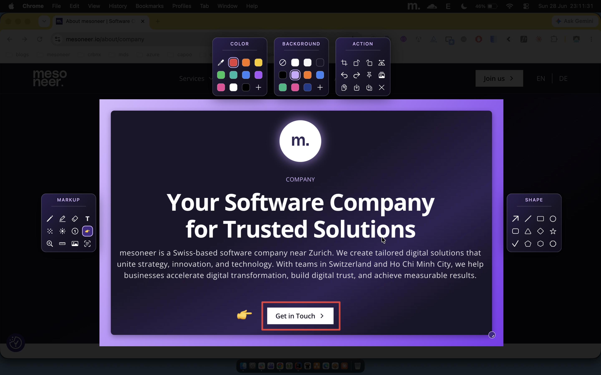
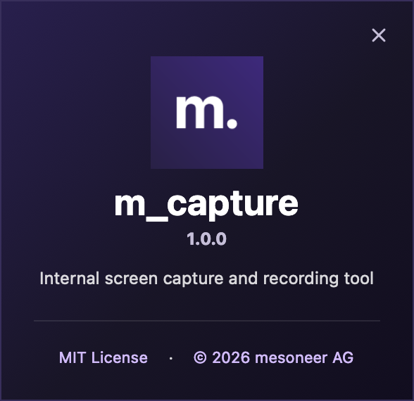

# m_capture

> A macOS menu-bar utility for screenshots and screen recording — capture a region,
> annotate it in place, and copy or save the result. Built in **Swift + AppKit** with
> **zero external dependencies**; all processing happens locally on your machine.


Press a hotkey and drag to select a region; an **in-place annotation editor** opens
immediately, where you can highlight, blur, and add arrows or numbered steps before
copying the result to the clipboard or saving it to disk. The app runs in the menu
bar, with no Dock icon.

<p align="center">
  
  <br>
  <em>Capture a region, then annotate it in place — highlight, arrow, blur, numbered steps, and more.</em>
</p>

## Features

A complete screenshot workflow — capture, annotate, and share — that runs entirely
on-device, with no subscriptions, cloud services, or accounts.

**📸 Capture**
- **Global hotkeys** — `⌃⇧X` for a screenshot, `⌃⇧R` to record; both fully rebindable.
- **Region or full screen** — drag to select a region, or press **Space** to capture the whole screen in a single click. Multi-monitor aware.
- **Self-timer** — a 3, 5, or 10-second delay with a menu-bar countdown, plus an optional mouse cursor and shutter sound.
- **Recording** — drag a region and record it in-app to an MP4 (HEVC), with a floating timer/size bar and pause/stop; optionally mixes in system and/or microphone audio.
- **Configurable after-capture action** — open the editor, save directly to disk, or copy to the clipboard.
- **Launch at login** — start automatically with the system.

**✏️ Annotate & edit** — an in-place editor in which every tool is a single keystroke, with full undo and redo.
- **Draw** — pencil, highlighter, and eraser.
- **Shapes** — arrows (with bendable curves), lines, rectangles, ellipses, triangles, diamonds, stars, polygons (pentagon, hexagon, octagon), rounded rectangles, and checkmarks.
- **Text & counters** — inline text labels, auto-incrementing badges (numbers, letters, or Roman numerals), and emoji stamps.
- **Focus & redaction** — **blur** to obscure sensitive information, **spotlight** to dim the surroundings, and **zoom** callouts to magnify detail.
- **Measure & compose** — an on-screen **ruler**, image overlays, and an **eyedropper** for color matching.
- **Color** — a 10-color palette with a custom hue and brightness picker.
- **Select & move** — grab any placed mark with the **Select** tool (`V`) to drag it elsewhere, resize it from a corner knob, or delete it — no need to undo and redraw.
- **Transform** — crop, rotate, flip, and aspect-locked resize, all baked into the export.

**🚀 Share**
- **Copy text / QR (OCR)** — extract text or decode a QR code from any capture, on-device via Apple Vision.
- **Pin to screen** — keep a capture floating above other windows, across Spaces.
- **Share-ready backgrounds** — padding, rounded corners, and a soft shadow over 10 solid or gradient presets, or a custom color.
- **Before/After GIF** — export a looping GIF that toggles the annotations on and off.
- **Flexible output** — copy to the clipboard, save as PNG, JPEG, HEIC, or TIFF to a configurable folder, or use **Save As…** to choose a location.

📖 Full reference: **[`USAGE.md`](USAGE.md)**.

## Install

1. Download the latest **`m_capture.dmg`** from [**Releases**](https://github.com/tuyen-nguyen-mesoneer/m_capture/releases) and open it.
2. **Drag m_capture into your home Applications folder** (`~/Applications`). Because the
   app isn't notarized, macOS would block it on first launch — open **Terminal** and clear
   the download quarantine:

   ```sh
   cd ~/Applications && xattr -dr com.apple.quarantine m_capture.app
   ```
3. **Double-click m_capture** to launch it — the menu-bar **m.** icon appears, and you can
   eject the disk image.
4. Grant **Screen Recording** permission when prompted (see [Permissions](#permissions)).

To build it yourself instead, see [Build from source](#build-from-source).

## Updates & feedback

**m_capture** checks GitHub Releases for newer builds — silently once a day, and on
demand via **Check for Updates** in the menu. A newer version downloads and installs
itself in place; it runs the next time you launch (**Check for Updates** offers to
relaunch right away). Living in `~/Applications` means updates apply without admin
prompts and your Screen Recording permission carries over.

To report an issue, use **Report a Bug** in the menu — it opens a
[pre-filled GitHub issue](https://github.com/tuyen-nguyen-mesoneer/m_capture/issues/new)
with your app and macOS versions already attached, so reports arrive with the
essential details in place.

## Permissions

**m_capture** requires **Screen Recording** permission, as it captures through the
system `screencapture` tool. macOS prompts for this on your first capture; grant it
under **System Settings → Privacy & Security → Screen Recording**, then relaunch the
app. **A blank capture is almost always caused by a missing grant.** Global hotkeys
use Carbon and require no additional permission.

## Build from source

`./build.sh` builds the app into `build/m_capture.app` and writes `m_capture.dmg`
to the repository root; it requires only the Xcode Command Line Tools. See
**[`CONTRIBUTING.md`](CONTRIBUTING.md)** for prerequisites, the faster development
loop, and the source map.

## License

**MIT License** — © 2026 [mesoneer AG](https://www.mesoneer.io/?r=0). See **[`LICENSE`](LICENSE)** for the full text.

<p align="center">
  
</p>
