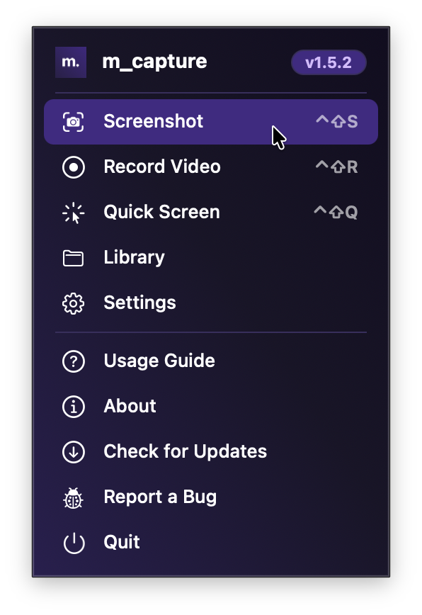
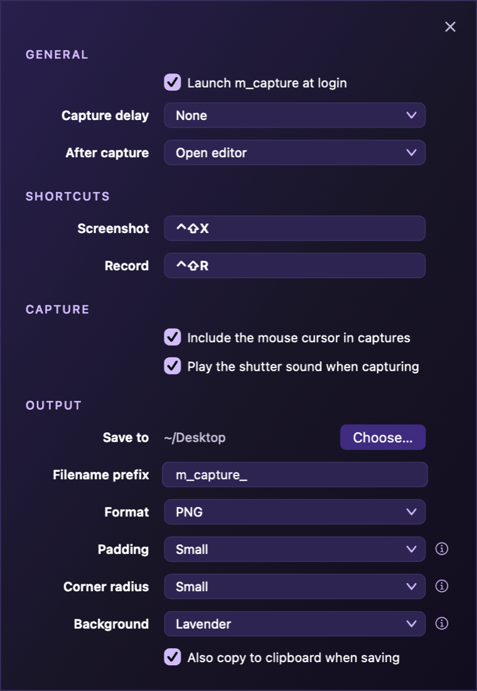

# m_capture — usage & reference

A complete reference to the menu, the capture flow, the annotation tools, keyboard
shortcuts, settings, and troubleshooting. For installation and build instructions,
see the [README](README.md).

- [The menu](#the-menu)
- [Taking a screenshot](#taking-a-screenshot)
- [Recording](#recording)
- [The annotation editor](#the-annotation-editor)
- [History](#history)
- [Settings](#settings)
- [Troubleshooting](#troubleshooting)

---

## The menu

Click the **m.** menu-bar icon to open the menu — its header shows the current
version on a badge. If the menu bar is hidden (notch, menu-bar hider), click the
**m.** icon in the **Dock** to drop the same menu instead. **Screenshot** and
**Record** also have global hotkeys (`⌃⇧S` / `⌃⇧R`) that fire directly, without
opening the menu.

  
   
  <em>The branded menu-bar dropdown.</em>

| Menu item             | Hotkey | What it does                                                                                              |
|-----------------------|:------:|------------------------------------------------------------------------------------------------------------|
| **Screenshot**        | `⌃⇧S`  | Dim the screen; drag a region, or press **Space** to pick a window or the whole screen; open the editor.  |
| **Record Video**      | `⌃⇧R`  | Dim the screen; pick a region, a window, or the whole screen; record it in-app to an MP4.                 |
| **Draw on Screen**    | `⌃⇧D`  | While recording, sketch on screen — freehand or shapes; marks fade on their own.                          |
| **History**           |   —    | Open the [History](#history) panel — the most recent captures with quick actions.                         |
| **Library**           |   —    | Open the save folder in Finder.                                                                           |
| **Settings**          |   —    | Language, shortcuts, capture delay, save location, format, video options, more.                           |
| **Check for Updates** |   —    | Check GitHub Releases for a newer version.                                                                |
| **Quit**              |   —    | Quit `m_capture`.                                                                                         |

**Usage Guide**, **Report a Bug**, and the version/license information live in
**Settings → About** — an identity card with the logo, version, the MIT · ©
[mesoneer AG](https://www.mesoneer.io/?r=0) line, and buttons for both actions.

While a recording is in progress, the menu also shows **Stop Recording**,
**Stop & Save as GIF**, **Stop & Trim…**, **Discard Recording**,
**Pause / Resume Recording**, and — if the floating bar is minimized — **Show
Recording Bar**, so the whole recording can be driven from the menu bar.

The app shows **one panel at a time**: opening Settings, History, or the trim
panel closes the others, opening the menu closes any open panel, and starting a
capture or recording closes them all so nothing ends up in the shot.

---

## Taking a screenshot

1. Press `⌃⇧S`. The screen dims and the cursor becomes a crosshair.
2. **Drag** to select a region. A live cutout shows the area bright with a
   `width × height` label. Press **Space** to cycle modes — the cursor switches to a
   camera glyph for the other two: **Window** — hover over a window to wash it in a
   light purple tint so the target is obvious, then release the mouse over it to
   capture just that window; and **Screen** — the whole display is tinted and a
   single click captures it. Space again returns to region selection. All three
   modes work on every connected display, not just the one you started on.
   The **previous region** shows as a dashed outline on its display — press
   **Return** to re-capture it without re-dragging (the banner hints when it's
   available; it persists across launches).
3. Release — the [editor](#the-annotation-editor) opens with your capture, its
   cursor switching to match whichever tool is active (arrow by default).
4. Annotate, then **Copy** (`⌘C`) or **Save** (`⌘S`). `Esc` cancels.

  
   
  <em>Drag to select — the chosen region stays bright while the rest dims.</em>

Captures save to the Desktop as a PNG by default and copy to the clipboard. The
filename format, location, image format and auto-copy are all configurable in
[Settings](#settings).

---

## Recording

1. Press `⌃⇧R`. The screen dims — the same overlay as a screenshot (with the
   previous region re-offered on **Return**, exactly like a screenshot).
2. Choose what to record: **drag** a region, or press **Space** to cycle to
   **Window** (hover a window to tint it, release the mouse over it to record just
   that window) or **Screen** (the display is tinted; click to record it whole). All
   three work on any connected display. An optional **countdown** (3/5/10 s,
   Settings → Video) counts down over the region before frames start.
3. Recording starts right away — the shareable-content lookup is prefetched while
   you drag, so the timer starts moving almost immediately. The floating bar
   (live timer, estimated file size, quality badge, pause/stop) starts
   **minimized to the menu bar** by default; use **Show Recording Bar** in the
   menu to reveal it, or turn the default off in **Settings → Video**. When
   visible, drag anywhere on the bar's background to move it (open-hand cursor).
4. **Stop** — press `⌃⇧R` again (the record hotkey toggles), click **Stop** on the
   bar, or use the menu's **Stop Recording**. The `.mp4` (HEVC video, optional AAC
   audio) finalizes into your save folder and the [History](#history) panel opens
   with it on top. Two more stop variants live in the menu:
   - **Stop & Save as GIF** — converts the take to a looping 10 fps GIF (capped at
     960 px) and keeps only the GIF; the menu-bar icon shows **GIF…** while it
     converts.
   - **Stop & Trim…** — opens a trim panel with a live preview and draggable
     in/out handles; **Save** cuts losslessly (no re-encode) over the file.
5. **Discard** — `⌥` + the record hotkey (`⌥⌃⇧R` by default), the menu's
   **Discard Recording**, or **Esc** while the bar is visible; a confirmation
   protects the take. (**Esc**/**Return** work only while the bar is shown and
   focused — with the bar minimized, use the hotkeys or the menu.)

**Knowing it's recording, and controlling it from the menu bar:** while recording, the
menu-bar **m.** icon becomes a **red dot with a live timer** (grey "Paused" when
paused); the whole flow — stop (plain, GIF, trim), discard, pause/resume, show the
bar — is available from the menu.

Quality, **frame rate** (30 or 60 fps), the countdown, a **mouse-click ripple**
overlay (clicks show as expanding rings in the video), the minimized-bar default,
and the audio source live in **Settings → Video**. Audio defaults to **None** —
opt into system audio, the microphone, or both. If the microphone is requested but
permission is denied, the recording continues without the mic track. Quitting the
app mid-recording still finalizes a playable file, and if the recorded display is
disconnected the recording stops itself and saves the partial file.

---

## Drawing on screen while recording

Point at things as you talk: while a recording runs, press `⌃⇧D` (rebindable) to
enter **draw mode** and sketch straight onto the screen. Everything you draw is
captured into the video — the overlay is composited into the frames, the same way
click ripples are.

- **Enter / leave** — `⌃⇧D`, the **pencil** tile on the floating bar (it turns
  lavender while active), or **Draw on Screen** in the menu. **Esc** leaves draw
  mode; it never discards the recording.
- **Tools** — while drawing, single letters switch tool: **P** pencil (freehand),
  **R** rectangle, **C** circle, **L** line, **A** arrow. The tool you used last is
  remembered for the next recording, and every letter is rebindable in
  **Settings → Drawing**.
- **Constrain** — hold `⇧` while dragging for a true square or circle, or to snap a
  line/arrow to 45° steps — the same convention as the annotation editor.
- **Marks fade by themselves** — a finished mark disappears a few seconds after you
  release the mouse, so a long recording never accumulates stale annotations. Set
  the delay (or **Never**) in Settings → Drawing.
- **Clear** — press **⌫** to wipe everything at once, or use **Clear Drawings** in
  the menu. (**C** selects the circle tool, so it does not clear.)

While draw mode is on, clicks go to the drawing overlay rather than the app
underneath — that is the mode's contract. The record bar stays clickable, so
**Stop** and **Pause** are always reachable.

**Not available for window recordings.** A single-window recording captures only
that window's own content, so nothing drawn over it could ever appear in the video —
the pencil tile and menu items are hidden for those takes. Record a **region** or the
**whole screen** to draw.

Colour, thickness (thin / medium / thick / heavy), fade delay and the tool letters
all live in **Settings → Drawing**. Colour offers the editor's palette as swatches
plus a custom hue/brightness picker. Changes apply to the *next* mark, so you can
retune mid-recording.

---

## Zooming while recording

Push in on the detail you are talking about: while a recording runs, press `⌃⇧Z`
(rebindable) to zoom the **video** in on the cursor, and press it again to zoom back
out. Your own screen is never magnified — only the recording.

- **Anchored where you point.** The zoom centres on wherever the cursor is at the
  instant you press, so it lands on what you are pointing at rather than wherever
  the view happened to be last time.
- **Eased, not snapped.** The factor animates in and out over about half a second,
  and pressing again mid-animation reverses smoothly instead of jumping.
- **The camera follows, slowly.** While zoomed, the view glides after the cursor with
  a deliberate lag and a small dead-zone, so it holds still through hand jitter
  instead of drifting. Your pointer itself is untouched; it *reads* calmer because the
  frame is magnified and the camera trails it.
- **You can see what is in frame.** Because your screen is not zoomed, a bracketed
  lavender frame marks the area being recorded, with a badge showing the live factor
  (`2×`). It fades in, shrinks from the full frame down to the zoomed area as the zoom
  eases, and glides with the camera. It is excluded from the capture, so it guides you
  without ever appearing in the video.
- **Also visible elsewhere:** a toast names the state on each toggle (`Zoom 2×` /
  `Zoom off`), the record bar's magnifier tile turns lavender, and the menu-bar
  indicator shows the factor next to the timer — which matters because the bar starts
  minimized.

**Not available for window recordings.** A single-window recording has no fixed
display rect to map the cursor into, so the shortcut and the controls are hidden for
those takes. Record a **region** or the **whole screen** to zoom.

The magnification (**1.5× / 2× / 3×**, default 2×) is in **Settings → Video → Zoom
level**, and the shortcut is rebindable in **Settings → Shortcuts**.

---

## The annotation editor

The editor frames your image on a dark backdrop with tools in **clusters**
(Markup, Shapes, Style, Actions, Background). For small or very large selections,
the clusters gather into one draggable panel so they never cover the image.

### Tools

**Markup** — draw, redact, label and stamp.

| Tool           | Key  | Description                                                                            |
|----------------|:----:|----------------------------------------------------------------------------------------|
| Pencil         | `P`  | Freehand thin stroke.                                                                  |
| Highlighter    | `H`  | Thick, translucent marker.                                                             |
| Eraser         | `E`  | Remove the annotation under the click.                                                 |
| Text           | `T`  | Click to place a label and type inline. A floating bar lets you set size, bold, alignment and the box's own background (fill/outline + color) while you type.  |
| Blur           | `B`  | Soften a region (redact sensitive content).                                            |
| Spotlight      | `S`  | Dim everything outside a rectangle.                                                    |
| Counter        | `C`  | Auto-incrementing badge — numbers, letters or Roman. Deleting one renumbers the rest so the sequence stays in order. |
| Emoji          |  —   | Stamp an emoji (click the tile to choose).                                             |
| Zoom           | `Z`  | Magnify a region into a callout bubble.                                                |
| Ruler          |  —   | Drag to measure at any angle (hold `⇧` to snap horizontal/vertical); the placed mark stays live to reshape by its endpoints or move it. |
| Overlay image  |  —   | Add an image — paste (`⌘V`), drop a file, or click to choose (with an opacity slider). |
| Copy text / QR | `⌘T` | OCR — drag over text or a QR code to recognize & copy it.                              |

**Shapes** — drag to draw; all hollow outlines. Shapes, arrows and lines are
**drag-only**: a bare click places nothing, so stray clicks never litter the
canvas. A just-drawn shape stays live with its handles showing, so you can resize
or move it (or press `⌫` to remove it) without switching tools.

| Tool              | Key | Tool      | Key |
|-------------------|:---:|-----------|:---:|
| Arrow             | `A` | Star      | `Y` |
| Line              | `L` | Pentagon  | `5` |
| Rectangle         | `R` | Hexagon   | `6` |
| Ellipse           | `O` | Octagon   | `8` |
| Rounded rectangle | `U` | Checkmark | `K` |
| Triangle          | `G` | Diamond   | `D` |

### Transform & actions

- **Select / edit** (`V`) — click any placed mark to select it, then **drag** to reposition or press `⌫` to delete it. **Shapes** resize from **eight handles** — four corners (free) and four edge midpoints (stretch a single side, e.g. widen a triangle). **Arrows and lines** show three handles — both **endpoints** and a **bend** handle at the apex. The **ruler** shows two endpoint handles (no bend, so its distance label always matches what's drawn). Text, emoji, counters, blur, spotlight, overlays and zoom callouts resize from a corner knob; freehand strokes are move-only. Everything can also be edited right after you draw it, without switching to Select.
- **Crop** — drag a region, then `↵` (or **✓**) to apply.
- **Rotate** — 90° right (clockwise).
- **Flip horizontal** — mirror the image left↔right.
- **Adjust the capture region** — drag any of the **eight handles** around the capture (four corners + four edge midpoints) to change what's captured: trim inward to crop, or drag outward to re-grab a **larger** area of the screen. Corners move both axes, edges a single one.
- **Pin to screen** (`⌘P`) — float the capture always-on-top across Spaces. Drag to move, corner-drag to scale, right-click for **Copy / Save / Reset size / Close** (`Esc` / `⌘W` close). Pin several at once.
- **Before/After GIF** — export a two-frame looping GIF that toggles the annotations on and off, useful for highlighting before-and-after differences.
- **Undo / Redo / Copy / Save / Save As / Cancel** — see the shortcut table below.

### Style

- **Palette:** red, orange, yellow, green, blue, purple, pink, white, black, plus
  **+** for a custom color (hue strip + brightness square).
- **Eyedropper** (`I`) — sample a color from the screenshot to match it.
- **Stroke width** — the line-weight tile cycles **Thin → Medium → Thick**; the new
  width applies to marks you draw next and to the currently selected mark.

### Backgrounds

The **Background** cluster wraps your capture in a share-ready frame — padding,
rounded corners and a soft shadow. Pick **None** (default), one of **10 presets**
(White, Light, Dark, Black; Lavender / Sunset / Ocean / Forest / Candy / Midnight
gradients), or **+** for a custom color. It previews live and is baked into Copy,
Save and Pin (OCR always uses the un-framed image).

### Keyboard shortcuts

| Shortcut          | Action                                               |
|-------------------|------------------------------------------------------|
| `⌘Z` / `⇧⌘Z`      | Undo / Redo                                          |
| `⌘C`              | Copy to clipboard & close                            |
| `⌘S`              | Save to your save folder & close (opens History)     |
| `⇧⌘S`             | Save As… — choose location & close (opens History)   |
| `⌘T`              | Copy text / QR (OCR) — then drag over text or a code |
| `⌘P`              | Pin to screen & close                                |
| `↵`               | Apply a pending crop                                 |
| `⌫` / `⌦`         | Delete the selected mark, or a just-drawn shape/arrow |
| `Esc`             | Cancel & close                                       |
| `P` `H` `V` `T` … | Select a tool — single key (see tables above)        |

> Single-key tool shortcuts are ignored while typing into a text annotation.

---

## History

**History** in the menu opens a panel with the **24 newest captures** from the
save folder — screenshots and recordings alike, newest first, as thumbnail cards
showing the filename, capture date, and a play badge on videos. The panel sizes
itself to what's there (fewer files, smaller panel) and also opens automatically
whenever a recording finishes or the editor saves a capture.

Hover a card for its actions:

| Action               | Applies to | What it does                                                        |
|----------------------|:----------:|----------------------------------------------------------------------|
| **Copy**             |    all     | Image to the clipboard (videos copy the file); confirms with a toast. |
| **Pin to screen**    |   images   | Float it always-on-top, like the editor's Pin.                       |
| **Trim**             |   videos   | Open the lossless trim panel on that recording.                      |
| **Reveal in Finder** |    all     | Select the file in Finder.                                           |
| **Move to Trash**    |    all     | Asks first, then trashes the file and confirms with a toast.         |

**Double-click** a card to open the file in its default app. History is a live
view over the save folder — files moved elsewhere simply don't appear.

---

## Settings

Open **Settings** from the menu. It's an icon **sidebar** — **General**,
**Shortcuts**, **Capture**, **Output**, **Video**, **Drawing** and **About** —
showing one section at a time in a fixed-size panel. Info dots (ⓘ) next to the less obvious
rows explain what they do.

  
   
  <em>The Settings panel — an icon sidebar with one section shown at a time.</em>

- **General** — **language** (System / English / Deutsch / Tiếng Việt — the whole
  UI is localized; changing it offers an immediate restart to apply); launch at
  login; capture delay (with menu-bar countdown); after-capture behavior (open
  editor / save to file / copy to clipboard).
- **Shortcuts** — rebind the **Screenshot**, **Record**, **Draw on Screen**, **Zoom
  While Recording** and **Force Quit** hotkeys (click a field, press the new combination).
- **Capture** — include the mouse cursor; play the shutter sound (off by default);
  confirm before discarding an unsaved capture.
- **Output** — save location; filename prefix (default `m_capture_`); image format
  (PNG / JPEG / HEIC / TIFF); background padding and corner radius (Square →
  Large); default editor background; also copy to clipboard when saving.
- **Video** — recording quality; audio source (**None** by default / system /
  microphone / both); frame rate (30 or 60 fps); start countdown (Off / 3 / 5 /
  10 s); **zoom level** (1.5× / 2× / 3×) for zooming while recording; show mouse clicks
  in recordings; start with the recording bar minimized;
  **simulate recording** (runs the whole flow but captures nothing and saves no file —
  for trying the recording tools while the Screen Recording permission is pending).

- **Drawing** — colour of on-screen marks (the editor's palette as swatches, plus a
  custom hue/brightness picker); thickness (thin / medium / thick / heavy); **fade
  after** (2 / 3 / 5 / 10 s, or **Never** to keep marks until you clear them); and the
  single letter that selects each tool while drawing (**P**encil, **R**ectangle,
  **C**ircle, **L**ine, **A**rrow — each rebindable, conflicts rejected).
- **About** — the app card (logo, version, MIT license · © mesoneer AG) with
  **Usage Guide** and **Report a Bug** buttons.

Settings persist across launches and apply to the editor's **Save**, the
pinned-window **Save**, and **Library**. Files are named
`<prefix><HH-mm-ss-dd-MM-yyyy>.<ext>`, uniquified with a `-1`, `-2`… suffix if a name
is already taken. If the save folder is missing or not writable, captures fall back to
the Desktop and a notice tells you where they went.

---

## Troubleshooting

`m_capture` needs **Screen Recording** permission (it captures in-process via
ScreenCaptureKit). Grant it under **System Settings → Privacy & Security → Screen
Recording**, then relaunch. Hotkeys use Carbon and need no extra permission.

| Symptom                               | Fix                                                                                                                                                                                                                                                                            |
|---------------------------------------|--------------------------------------------------------------------------------------------------------------------------------------------------------------------------------------------------------------------------------------------------------------------------------|
| Capture is blank / fails              | Grant **Screen Recording**, then relaunch (see above).                                                                                                                                                                                                                         |
| Hotkeys do nothing                    | Another app may own them, or `m_capture` isn't running — relaunch it.                                                                                                                                                                                                          |
| "App can't be opened" on first launch | Not notarized. Install to `~/Applications`, then run `cd ~/Applications && xattr -dr com.apple.quarantine m_capture.app` before opening.                                                                                                                                       |
| No menu-bar icon                      | The menu bar may be hidden (notch / menu-bar hider) — click the **m.** Dock icon to drop the menu; if there's no Dock icon either, the app isn't running, so launch `m_capture.app` again.                                                                                       |
| Can't find a saved screenshot         | Use **History** for the newest captures, or **Library** to open the save folder.                                                                                                                                                                                                |
| Hotkeys stop responding after a display change | Fixed captures time out and recover on their own; if a hotkey still does nothing, the editor may be open on another display — close it, or relaunch the app.                                                                                                            |
